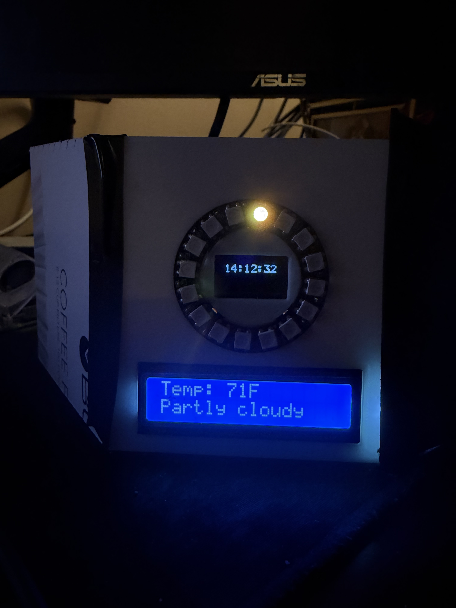

# WeatherDisplay

A C++ application for the Raspberry Pi 5 that drives three displays:

- **16x2 character LCD** showing current weather (temperature + conditions)
- **0.96" SSD1306 OLED** showing the current time
- **16-pixel WS2812 NeoPixel ring** showing the sun's position by day and the moon's illumination by night

Single self-contained binary, runs as a systemd service, no Python.



---

## Hardware

| Component        | Interface | Address / Pin                |
|------------------|-----------|------------------------------|
| Raspberry Pi 5   | -         | -                            |
| LCD1602 + I2C bp | I2C bus 1 | 0x27                         |
| SSD1306 OLED     | I2C bus 1 | 0x3C                         |
| WS2812 ring (16) | SPI0 MOSI | GPIO 10 / header pin 19      |
| 5V power         | Pi 5V     | header pin 2 or 4            |
| Ground           | Pi GND    | any GND pin                  |

The LCD and OLED share the I2C bus (different addresses). The NeoPixel ring is driven over SPI rather than a regular GPIO because the Pi 5 cannot reliably bit-bang the WS2812 protocol from userspace; SPI MOSI clocked at 6.4 MHz is used to synthesize the WS2812 bit timing.

---

## Software architecture

One C++ binary (`weather_display`) running a 1 Hz event loop:

| Subsystem   | Driver        | Update frequency                                |
|-------------|---------------|-------------------------------------------------|
| OLED time   | `oled.cpp`    | every second                                    |
| LED ring    | `ring.cpp`    | every minute                                    |
| LCD weather | `lcd.cpp`     | every `UPDATE_INTERVAL` seconds (default 600)   |

All three subsystems share the main thread. Weather fetches use libcurl with a 10s total timeout so a hung HTTP call cannot stall the OLED tick.

Sunrise/sunset/moon math is computed locally (NOAA Solar Calculator algorithm + synodic-month moon phase). No external service is called for celestial data.

Logging uses a simple `LOG_INFO` / `LOG_WARN` / `LOG_ERROR` macro set defined in `include/log.h`. Output format is `[HH:MM:SS] [LEVEL] message`. INFO goes to stdout; WARN and ERROR go to stderr. systemd's journal adds its own absolute timestamp on top.

---

## Build

### On the Pi (production)

```sh
sudo apt update
sudo apt install -y build-essential cmake git i2c-tools libcurl4-openssl-dev wiringpi
# If `gpio -v` fails on Pi 5, install from the maintained fork instead:
#   https://github.com/WiringPi/WiringPi

# Enable I2C and SPI
sudo raspi-config nonint do_i2c 0
sudo raspi-config nonint do_spi 0
sudo usermod -aG spi $USER
# Log out and back in (or reboot) for the spi group membership to apply.

git clone https://github.com/GageLawton/WeatherDisplay.git
cd WeatherDisplay
make
```

The binary lands at `build/bin/weather_display`.

### On Mac (development)

The project compiles on macOS (Apple Silicon, Intel, both fine) using mock backends for I2C, the LCD, and SPI. Useful for iterating on logic without hardware.

```sh
make -f test/Makefile.mac
./weather_display_mac
```

The mock build prints what would have been written to the LCD, runs the real weather fetch via libcurl, and silently exercises the OLED + ring code paths.

---

## Test harnesses

Per-subsystem test programs live under `test/` and have their own makefiles. Each writes visualizations into `test_output/` as PPM or PGM files openable in Preview.

```sh
# Sunrise/sunset/moon math against current date in Westmont
make -f test/Makefile.celestial && ./test_celestial

# OLED rendering at multiple sizes and formats
make -f test/Makefile.oled && ./test_oled
open test_output/*.pgm

# NeoPixel driver + orientation transform visualizer
make -f test/Makefile.neopixel && ./test_neopixel
open test_output/ring_*.ppm

# Ring controller (sun-by-day, moon-by-night) across a simulated day
make -f test/Makefile.ring && ./test_ring
open test_output/ring_day_*.ppm
```

---

## Configuration

Two layers, in order of precedence:

1. **Environment variables** (highest priority). Loaded by systemd from `.env` in the project root, or set manually in the shell:

   | Variable           | Purpose                              |
   |--------------------|--------------------------------------|
   | `WEATHER_API_KEY`  | weatherapi.com API key (required)    |
   | `WEATHER_LOCATION` | City for weather lookup              |
   | `UNITS`            | `F` or `C` (default `F`)             |
   | `UPDATE_INTERVAL`  | Seconds between weather fetches      |
   | `OLED_FORMAT`      | OLED time format string              |
   | `OLED_SCALE`       | OLED text scale (`auto` or `1`-`4`)  |

2. **`config.json`** in the project root:

   ```json
   {
     "location": {
       "latitude": 41.7958,
       "longitude": -87.9756
     },
     "led": {
       "spi_device": "/dev/spidev0.0",
       "count": 16,
       "brightness": 0.4,
       "offset": 0,
       "clockwise": false
     },
     "oled": {
       "format": "II:MM AP",
       "scale": "auto",
       "i2c_address": "0x3C"
     },
     "UNITS": "F",
     "UPDATE_INTERVAL": 600
   }
   ```

### OLED time format placeholders

| Placeholder    | Example       |
|----------------|---------------|
| `HH:MM:SS`     | `13:45:22`    |
| `HH:MM`        | `13:45`       |
| `II:MM:SS`     | `01:45:22`    |
| `II:MM`        | `01:45`       |
| `II:MM AP`     | `01:45 PM`    |
| `II:MM:SS AP`  | `01:45:22 PM` |
| `SS`           | `22`          |

`scale` can be `"auto"` (largest size that fits the display width) or `"1"` through `"4"`.

### LED ring orientation

`offset` is the physical pixel that should be treated as "logical 0" (useful for putting noon at the top regardless of how the ring is mounted). `clockwise: false` reverses the direction of increasing indices around the ring. Tune these two values together until the sun's position visually matches the time of day (rising on the left, peaking at top, setting on the right).

---

## Run as a systemd service

```sh
# Set secrets
cat > .env <<'EOF'
WEATHER_API_KEY=your_weatherapi_key
WEATHER_LOCATION="Westmont, IL"
EOF
chmod 600 .env

# Install
sudo make install-service

# Verify
systemctl status weather-display
journalctl -u weather-display -f   # Ctrl+C to exit log tail
```

The service is enabled on boot and restarts on failure with a 10-second backoff. The unit file is `systemd/weather-display.service`.

### Uninstall

```sh
sudo systemctl stop weather-display
sudo systemctl disable weather-display
sudo rm /etc/systemd/system/weather-display.service
sudo rm /usr/local/bin/weather_display
sudo systemctl daemon-reload
```

---

## Project layout

```
.
├── CMakeLists.txt              # Pi production build
├── Makefile                    # thin wrapper around CMake (only top-level Makefile)
├── README.md
├── config.json                 # runtime configuration
├── docs/
│   └── device.jpeg              # hero photo
├── include/
│   ├── celestial.h             # sunrise/sunset/moon math
│   ├── config.h
│   ├── i2c_bus.h               # I2C abstraction (real wiringPi / mock)
│   ├── json.hpp                # nlohmann/json single-header
│   ├── lcd.h
│   ├── log.h                   # LOG_INFO/WARN/ERROR macros
│   ├── neopixel.h              # WS2812 driver (real spidev / mock)
│   ├── oled.h, oled_font.h
│   ├── ring.h                  # high-level ring controller
│   ├── temperature.h           # cToF / fToC / toUnits helpers
│   └── weather.h
├── src/
│   ├── celestial.cpp
│   ├── config.cpp
│   ├── i2c_bus.cpp
│   ├── lcd.cpp                 # real (wiringPi) - excluded from Mac build
│   ├── lcd_mock.cpp            # mock - excluded from Pi build via CMake
│   ├── main.cpp
│   ├── neopixel.cpp
│   ├── oled.cpp, oled_font.cpp
│   ├── ring.cpp
│   └── weather.cpp
├── systemd/
│   └── weather-display.service
└── test/
    ├── Makefile.mac            # full binary build with mock backends
    ├── Makefile.celestial      # celestial math unit test
    ├── Makefile.neopixel       # NeoPixel driver + visualizer
    ├── Makefile.oled           # OLED renderer
    ├── Makefile.ring           # ring controller across a simulated day
    ├── test_celestial.cpp
    ├── test_neopixel.cpp
    ├── test_oled.cpp
    └── test_ring.cpp
```

---

## Development notes

- `lcd_mock.cpp` is excluded from the CMake build via `list(REMOVE_ITEM SOURCES ...)` to avoid duplicate-symbol errors. The Mac build (`test/Makefile.mac`) substitutes it for `lcd.cpp` explicitly.
- The I2C and SPI backends are swapped at compile time via `-DI2C_REAL` and `-DNEOPIXEL_REAL` respectively. Both are set by the CMake build; neither is set by the Mac dev makefiles.
- The LCD's contrast is set by a trim potentiometer on the back of the I2C backpack — not a software setting. If text appears as garbled symbols or invisible, this is almost always the cause.
- The NeoPixel ring's data wire must be on **GPIO 10 (SPI0 MOSI, header pin 19)**, not a generic GPIO. The Pi 5 cannot bit-bang WS2812 reliably from userspace.

---

## Dependencies

- `wiringPi` (I2C access on the Pi)
- `libcurl` (HTTP for weather API)
- `nlohmann/json` (vendored as `include/json.hpp`)
- Linux `spidev` (kernel SPI driver)
- A free [weatherapi.com](https://www.weatherapi.com/) API key

---

## License

MIT
